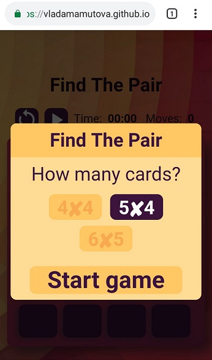
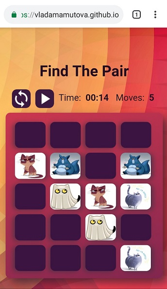
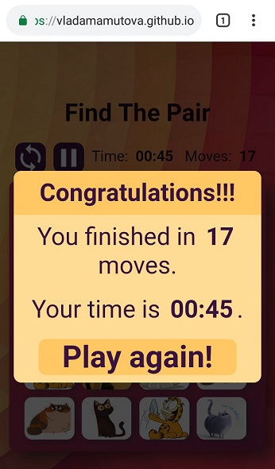

# Игра "Найди пару"
Игра "Найди пару" помогает развить способность к запоминанию, внимательность и сообразительность.

Игра доступна онлайн: https://vladamamutova.github.io/find-the-pair/.

JsDoc: https://vladamamutova.github.io/find-the-pair/JsDoc/.

DocBook: https://vladamamutova.github.io/find-the-pair/DocBook/.

## Об игре
Игра состоит из чётного количества карточек, под которыми находятся пары одинаковых картинок.

При запуске игры поле с карточками будет показано на несколько секунд и закрыто снова.
Постарайся запомнить как можно больше картинок!

Кликай по карточкам, запоминай, что изображено с обратной стороны, и ищи пары. Успехов!
## Цель игры
Цель игры заключается в том, чтобы за минимальное время и минимальное количество ошибок найти все одинаковые карточки на игровом поле.
## Особенности
* Возможность выбора количества картинок для повышения сложности игры;
* Открытие картинок на 2 секунды перед началом игры для их лучшего запоминания;
* Возможность поставить игру на паузу и собраться с мыслями;
* Отображение игрового счёта в виде времени прохождения игры и количества сделанный шагов;
* Яркие картинки для создания в памяти наиболее ярких зрительных образов;
* Адаптивный дизайн для игры как с мобильного устройства, так и с десктопа.

**[Попробуй, найди пару!](https://vladamamutova.github.io/find-the-pair/)**

